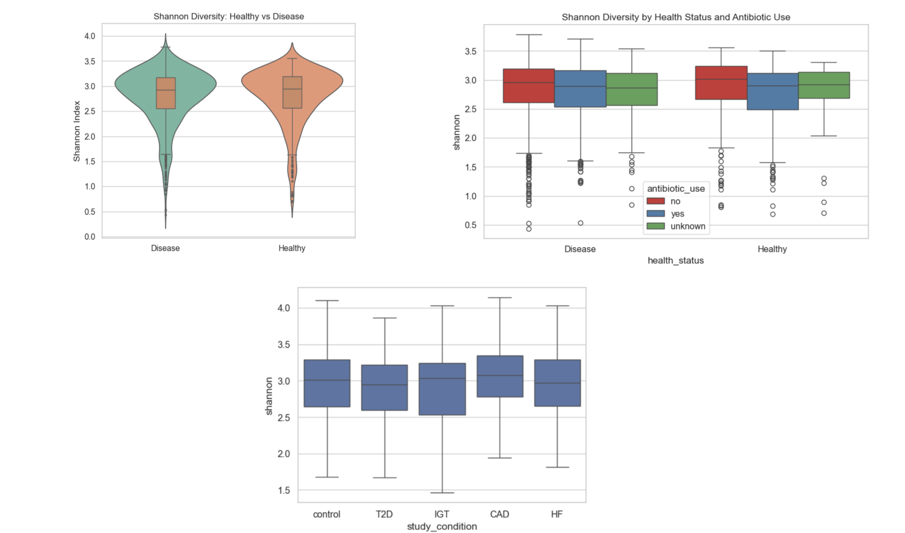
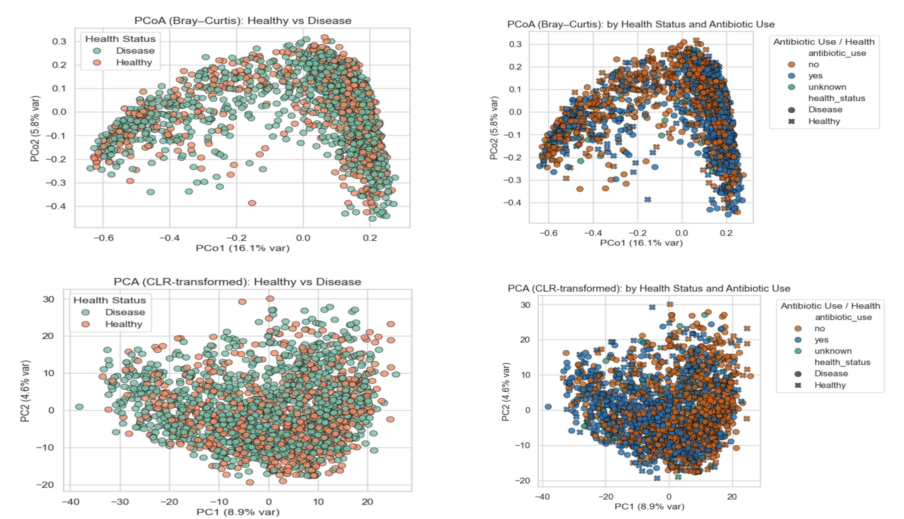
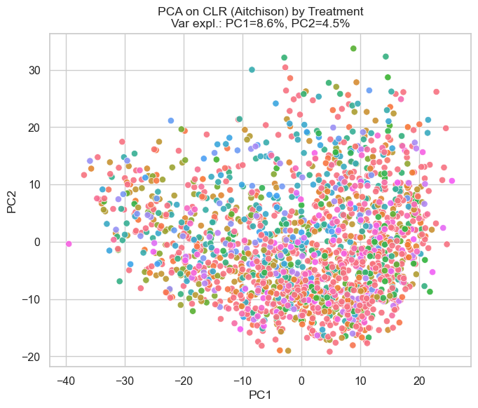
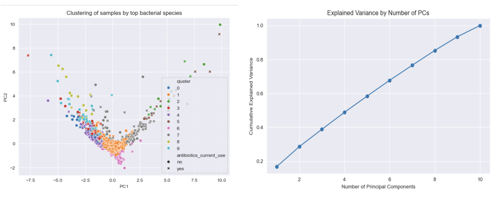
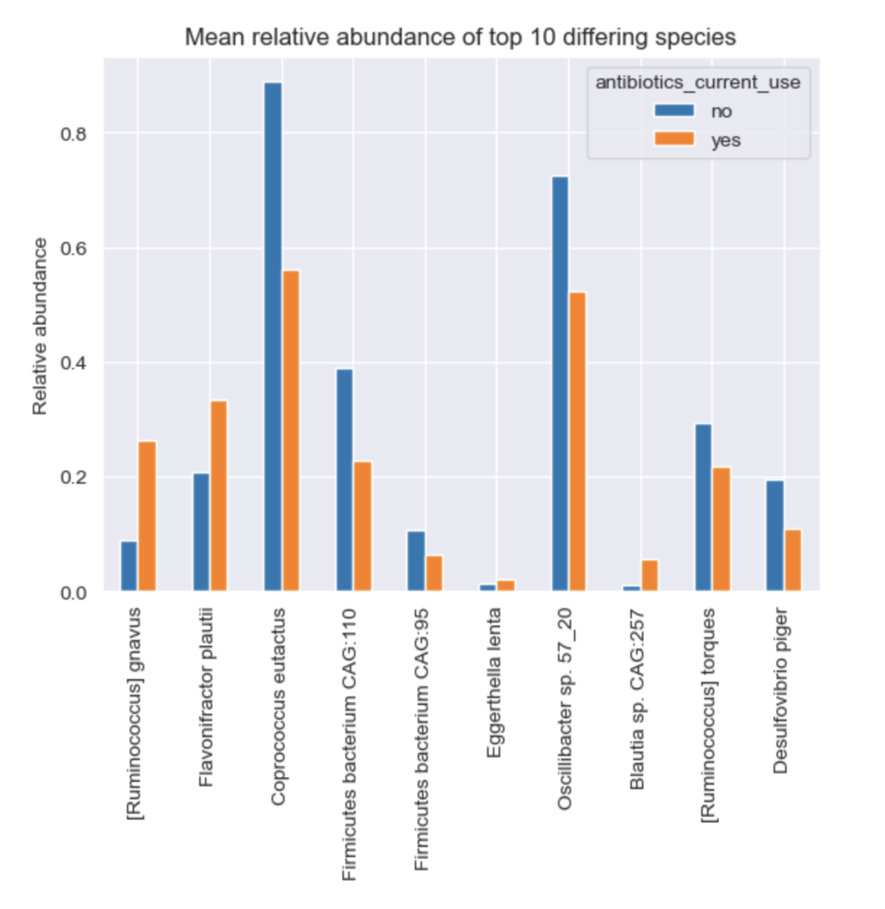

# Predicting Health Status from Gut Microbiome Profiles

Team Members : Anagha Krishna, Anushka Dongaonkar, Rutu Jaswanth Kothari, Arnav Gupte  
Midterm Report video link - https://youtu.be/DeGydPbBNaA  

## Project Description

This project explores whether gut microbiome composition can predict cardiometabolic disease status.  
We aim to understand if microbial diversity and abundance patterns can serve as biomarkers of health.

We compare two main approaches:
* Diversity-based features: ecological metrics like Shannon index, richness, and Simpson diversity.  
* Taxa-based features: species-level relative abundances.

We also examine how external factors such as antibiotic use and medical treatments influence gut microbiome composition and prediction accuracy.

### Specifically, we:
1. Compare alpha diversity between antibiotic vs. non-antibiotic users.  
2. Analyze beta diversity across disease conditions.  
3. Evaluate the effect of treatments on microbial community composition.  
## Project Goals

* Build and compare machine learning models (Logistic Regression, Random Forest, XGBoost).  
* Evaluate model performance using accuracy, precision, recall, F1, ROC-AUC, and PR-AUC (for imbalanced data).  
* Identify the most important microbial features contributing to disease prediction using PCA, LASSO, and SHAP importance.  
* Visualize how diversity and taxa composition differ between Healthy and Disease groups.  
* Assess how antibiotics and treatments impact microbial diversity and structure.

### Data

* Source: curatedMetagenomicData R package  
* Dataset: MetaCardis_2020_a (curated by Paolo Manghi)  
* Samples: 1,831 microbiome profiles from patients  
* Features: 697 microbial taxa (species level)  

# Midterm Report
## 1. Preliminary Visualizations of Data

We began by exploring the dataset to understand diversity patterns across individuals and disease conditions.

* Alpha diversity (within-sample): measured how many distinct microbial species were present per individual.  
  

* Beta diversity (between-sample): compared microbial composition across groups (IGT, HF, CAD, T2D, and controls).  
  

To better understand the relationships among samples, we also performed Principal Component Analysis (PCA). This helped visualize which features explain the most variation in the data and whether certain disease groups cluster together.

## 2. Detailed Description of Data Processing Done So Far

The dataset consisted of 1,800 patient samples with relative abundance values for around 600 microbial species.
To ensure high data quality:

* Microbes with more than 1% missing values were removed.
* Basic preprocessing such as normalization and handling of missing values was performed.
* The dataset required minimal cleaning overall, indicating good data integrity.
  This step ensured that downstream analyses such as diversity estimation and clustering were based on reliable, complete data.

We aim to perform feature selection using Lasso regression and SHAP in the coming weeks. 
## 3. Detailed Description of Data Modeling Methods Used So Far

We performed unsupervised learning techniques to uncover natural patterns in the data:

* Clustering analysis (using microbial composition features) was applied to check if patients naturally grouped by health condition.
* However, the resulting clusters were not clearly separable, indicating that microbial differences among disease conditions are subtle and complex rather than distinct.
Additionally, we performed statistical testing (Mann–Whitney U test and Kruskal-Wallis test) to identify microbes with significantly different abundances between disease groups.
These methods provided early insights into microbial patterns that may be relevant for future feature selection and predictive modeling.

## 4. Preliminary Results

* No distinct clusters emerged from unsupervised methods — highlighting strong individual variation.  
* Statistical tests (Mann–Whitney and Kruskal-Wallis) revealed several species that differ significantly across conditions.

These early findings form the foundation for the next phase, applying supervised learning models to predict health status and assess which microbes contribute most to disease differentiation.  

## 5. Future Directions
We started with unsupervised learning to detect natural groupings within the data:
Next, we will soon begin building supervised learning models using:
* Logistic Regression (with regularization)  
* Random Forest  
* XGBoost

To enhance interpretability, we plan to apply feature importance methods such as Boruta and SHAP.  
Evaluation will focus on metrics robust to class imbalance: AUC, balanced accuracy, and PR-AUC.

